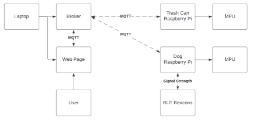

# IoT_Smart_Dog_Collar

## Objective 
Our goal is to develop a system that allows the user to keep an eye on their dog or pet and observe if they are accessing an area unaccompanied and interacting with the owner's belongings. In our example, a user's pet dog loves moving and knocking over a garbage can while the user is not there. Our solution would allow the user to observe the dog's state without constantly monitoring it.

## Design
The Project will use two raspberry Pi to receive data from the MPU sensors on the dog and garbage can. Our third device can be a laptop or Raspberry Pi that will operate the MQTT broker, a web server for the web page UI, and triangulation computation. Three BLE beacons are also required to locate the dog in the room. Aside from that, we will need one more BLE beacon installed on the garbage can to detect if the dog is precisely near the trash can.

<h1 align="center">
    
</h1>

The user attaches a raspberry pi with an MPU sensor to the dog to read movement data and assess whether or not the dog is moving. This gadget also serves as a receiver for Bluetooth Low Energy beacons. We triangulate the dog's position based on the relative signal intensity between the receiver and each beacon. The user additionally attaches a Raspberry Pi with an MPU sensor to the garbage can. This will detect if the garbage can is moving or not and whether it is at risk of being dealt with. If the dog is near the garbage can (identified by the RSSI intensity generated by a beacon on the trash can) and both are moving, we may believe the trash can is in danger. We then publish this data via MQTT so that the appropriate devices may receive and process it.

We can now display the data for the dog's status, location, the garbage can's state, and whether or not they can be interacted with on a UI. The UI is hosted on a web server on the MQTT broker device. The web server will be a listener to the MQTT topics that the other devices are publishing, allowing it to quickly display the required information and be replaced in the future if a new UI is chosen. Because it is a web page, it may be accessed from any device on the local network.

## Demo

For the Demo of the live project please follow the [link](https://youtu.be/L9ZbTyrODcE)

## Environment
- Python 3.7.3

## Requirements
### Software
- Python3 3.7.3
- paho-mqtt==1.6.1
- numpy==1.19.5
- mosquitto 
- wiotp-sdk
- requests==2.25.1
- RPi.GPIO==0.7.0
- MATLAB
- beacontools==2.1.0
- gattlib==0.20201113
- mpu6050-raspberrypi==1.2
- Pillow==8.1.2
- PyBluez==0.23
- requests-oauthlib==1.0.0
- responses==0.12.1
- sympy==1.10.1
- urllib3==1.26.5


Follow this [link](https://learn.adafruit.com/install-bluez-on-the-raspberry-pi/installation) and follow the steps to install Bluez

```
pip install requirements.txt
```

### Hardware
- x2 Raspberry Pi 3b
- x2 MPU6050 Accelerometer + gyro
- x4 Mobile phones with bluetooth
- 2 Power bank

To setup the hardware for both Pis, connect the following raspberry pi GPIO pins to the corresponding MPU pins.

GPIO 2 to SDA, <br />
GPIO 3 to SCL, <br />
5V to VCC, <br />
GND to GND <br />

## Procedure
To Track Dog's Status
1. Attach smart harness to dog
2. Setup up other raspberry pi on trashcan
3. ssh into both raspberry pis from a laptop
4. setup the three bluetooth beacons at locations inducated on UI
5. On the laptop, run the mqtt broker, the UI client and the code Laptop/laptop.py
6. On the trashcan Pi, run trashCan.py in the RPi_Trash_Can folder
7. on the smart harness, run dogPub.py in the RPi_dog folder
8. next on the smart harness, run ble_detection.py in the Triangulation folder

Once everything is connected and running, the UI should display the status of the dog and trashcan, and should start plotting the coordinates it is calculating from the RSSI values.

To Graph MPU Data:
1. Attach smart harness to dog
2. run "python3 RPi_dog/dog_movement_collection/dataCollect.py"
3. Follow along with prompts: Select task and name file
4. Have dog complete task
5. Program will end once dog remains still for 2-3 seconds
6. Move new files onto a seperate device which has MATLAB installed
7. run the MATLAB script "dogGraph.m"
8. Follow prompts: give file name and title for graph
9. Plot will be generated with accelerometer and gyro data
